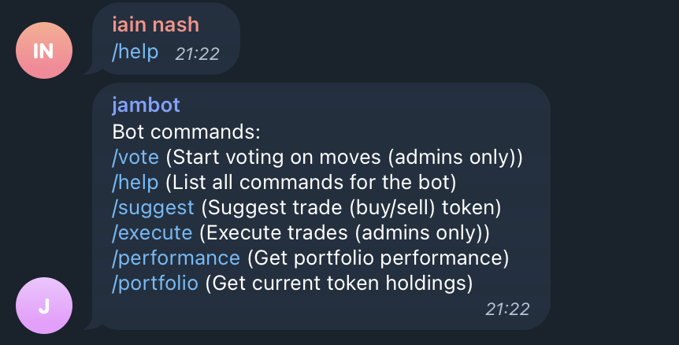
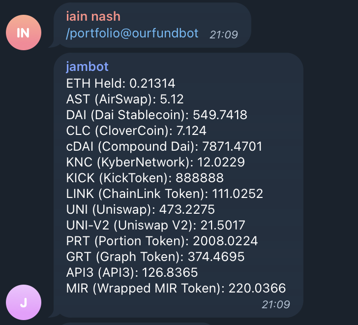

## JamBot! (bot)

An Ethereum bot for voting on shared wallet actions.

This powers our telegram bot and the DAPP to execute actions once voted on as a second component.

#### Bot commands: 
* `/vote` (Start voting on moves (admins only)) 
* `/help` (List all commands for the bot) 
* `/suggest` (Suggest trade (buy/sell) token) 
* `/execute` (Execute trades (admins only)) 
* `/performance` (Get portfolio performance) 
* `/portfolio` (Get current token holdings)

This runs on AWS and uses dynamodb for a data backend.

--- 

Example interactions:

1. Vote

2. Suggest

3. Ask Help

4. Portfolio

5. Performance

6. Dashboard for admins to execute moves
